# I like to print poker chips and stickers and stuff to give away.

Stickermule treats the 1px hexagon as a cut line.

They also offer an 8.5x11 sticker sheet, but in reality everyone only
wants one or two stickers for the projects they care about and the
rest end up in the garbage.

## Sticker sheets per project:

These are set up for 4x6 StickerMule sticker sheets.

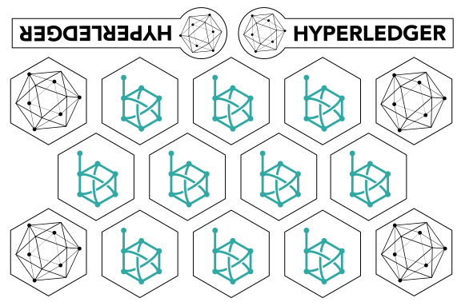
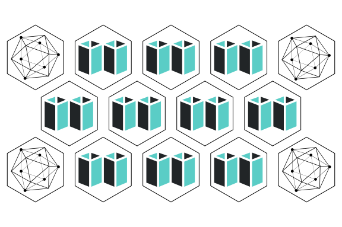
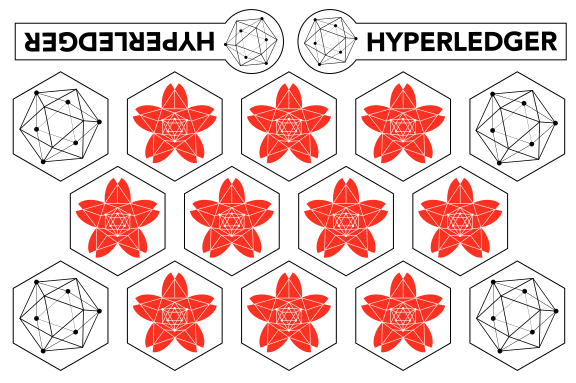
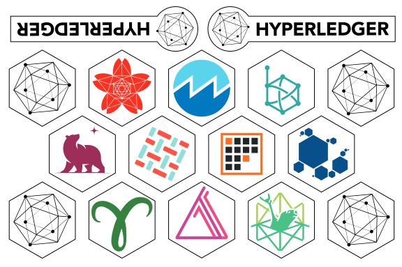
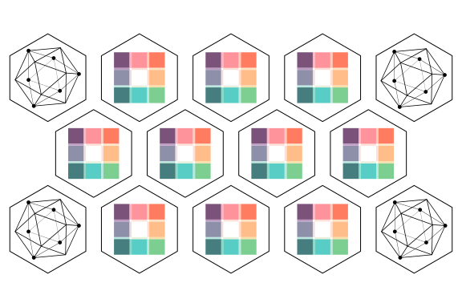
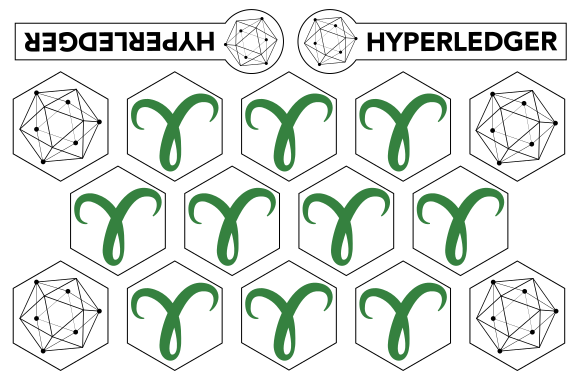
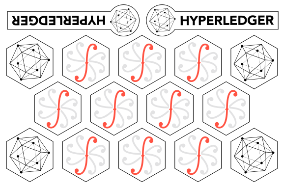
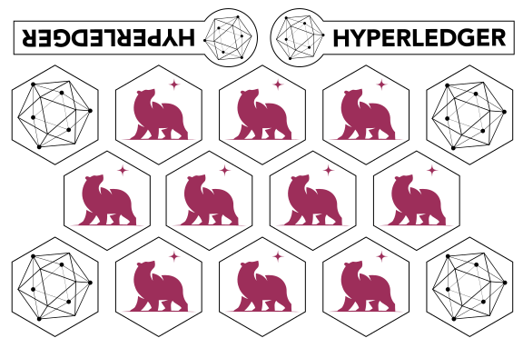

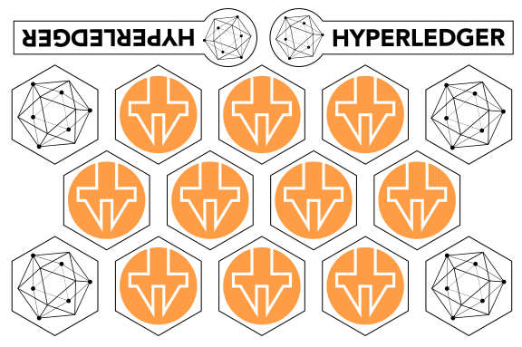
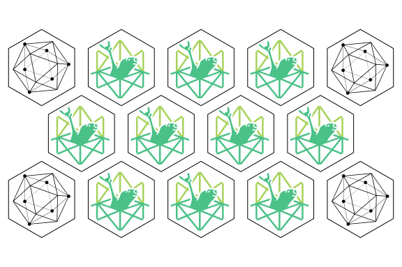
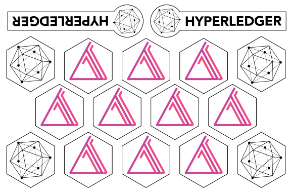
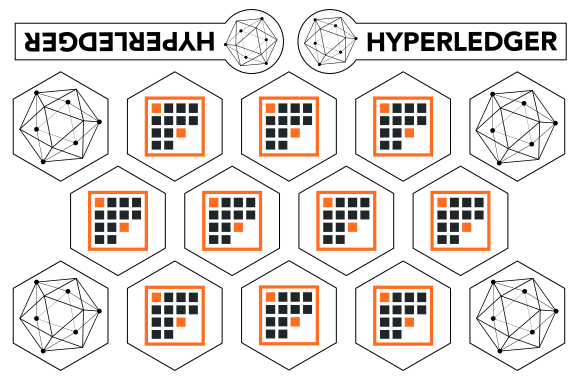
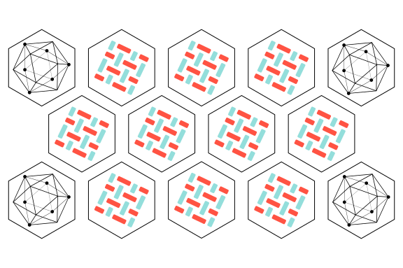

# Templates

## Sticker sheet with some projects:

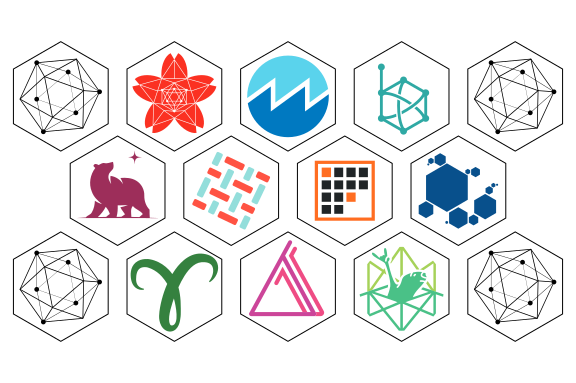

## Empty StickerMule template:

